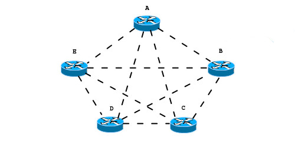
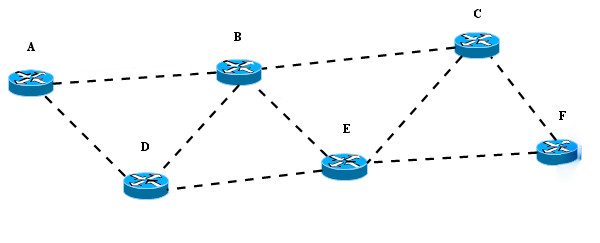
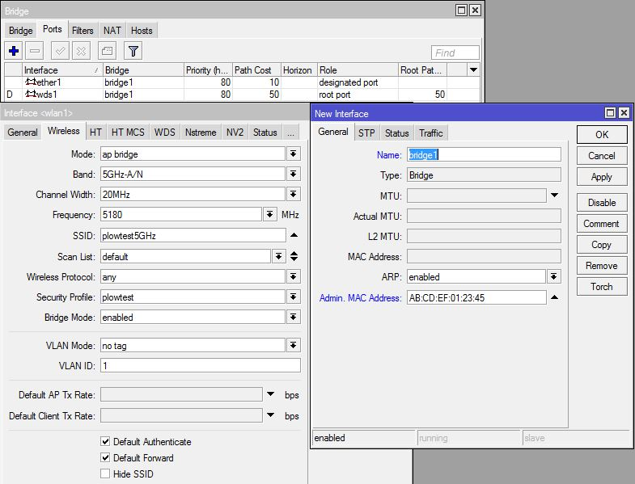
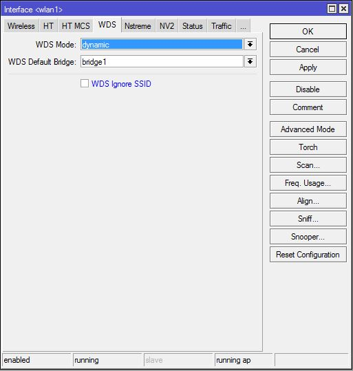
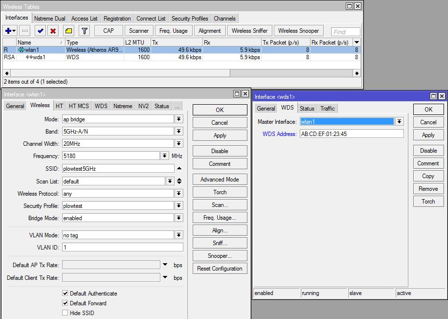
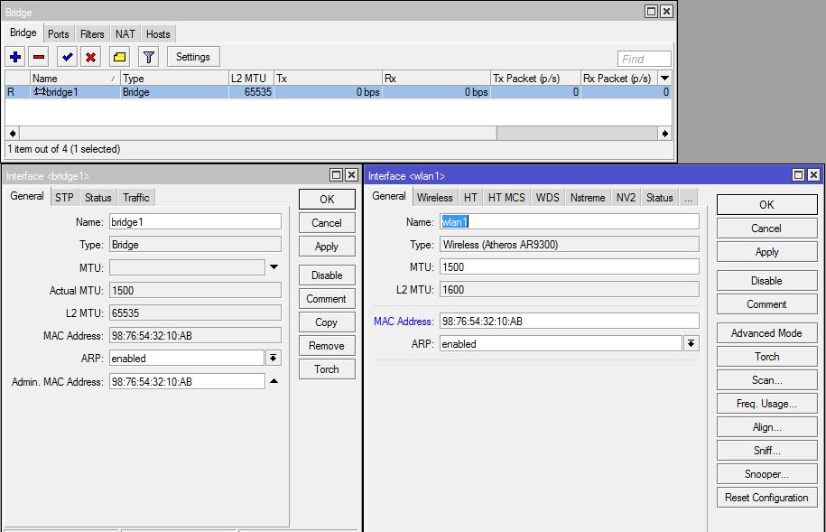
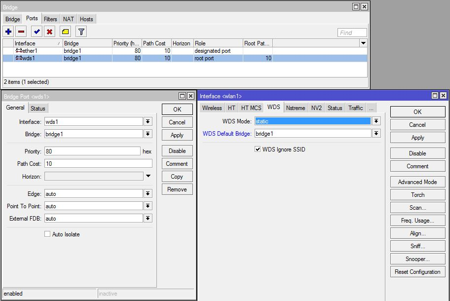

The MikroTik WDS (Wireless Distribution System) is a system that enables a wireless network to be expanded by multiple wireless access points. All MikroTik access point devices have the ability to create their own WDS. For the purposes of this blog we will be discussing the SXT Access Point device. This has a wlan and one ethernet port.

# What does the WDS accomplish?

The WDS makes it possible to create a wide area of connectivity by linking several access points together through the use of the MAC addresses of each access point. By linking all the access points together using WDS,
a person can move throughout the coverage area and still be able to have access across the entire network.

## Examples of Use Case for a WDS Network

A good case for the use of a WDS network would be where there are clusters of wireless devices that need to access the same network, but are not congregated enough to be covered by a single wireless access point.
Another case for WDS would be a situation where an alternate path for communications would be needed in case of communication failure on the primary path.

# Dynamic WDS vs Static WDS

## Dynamic WDS
Dynamic WDS means that any device that connects to the AP will automatically be added to the WDS network. All links to and from the device are created by the device on the fly. This is very useful for a network that has a topology that is changing frequently and allows a fairly quick means of adding new devices. Using a dynamic WDS, allows for devices (APs and stations) to discover the most optimal routing for the network, and self repairs its routing should any device in the routing suddenly loses communications. One of the disadvantages to a dynamic setup is if devices are added/removed the topology must be recalibrated by the entire network each time. This becomes a bigger issue if a device has a bad reception and is regulary losing connection with another access point as it can cause a disruption in the network routing. Due to the fact that all devices on a dynamic WDS network create connections to every other device on the network, troubleshooting any kind of networking issues becomes incredibly difficult.

### **Dynamic WDS Example**

In the image above, the dynamic WDS network has the following topology:
 A is WDS linked to B,C,D, & E
 B is WDS linked to A,C,D, & E
 C is WDS linked to A,B,D, & E
 D is WDS linked to A,B,C, & E
 E is WDS linked to A,B,C, & D

With this configuration, every device on the network can talk directly to each other device on the network. If any one of the devices loses direct communication, there are three other devices where it can route through to get back to the device it has lost communications with. To explain this better let's go through an example.

Assuming that something is causing interference between device A & B such that communcations are lost between the two devices, but no other communications are lost. In the case of the dynamic WDS, the WDS link for device B is automatically removed from device A, and the WDS link for device A is automatically removed from device B. So the new topology for the network would be:
 A is WDS linked to C,D, & E
 B is WDS linked to C,D, & E
 C is unchanged
 D is unchanged
 E is unchanged

Even though the WDS link is removed, they both are still on the same network and can still communicate with each other, just not directly. So device A can communicate to device B, but it has to go through C, D, or E first. Similarly, device B can communicate with device A, but it must first go through C,D or E first.

## Static WDS

Static WDS means the network administrator explicitly declares what access points (APs) and end points (stations) to which communications can be directed. This is useful for creating stable links between APs, eliminating unwanted routes, and network troubleshooting. The main drawback for using Static WDS is that each time a new device is added, whether replacing an existing device or adding a completely new device, all links to and from the device must be done manually on both the new device and the device it will connect to. This means the number of connections needed to set up a new device is 2^x where x is the number of devices to which the new device is being connected. Another drawback to using the static WDS is the human error factor such that a connection may missed or routing may be sub optimal.

### **Static WDS Example**

In the image above, the static WDS network has the following topology:
 A is WDS linked to B & D
 B is WDS linked to A, C, D, & E
 C is WDS linked to B, E, & F
 D is WDS linked to A, B, & E
 E is WDS linked to B, C, D, & F
 F is WDS linked to C & E

With this configuration, A can still communicate to F, but first it must go through either B or D. At each AP along the way, an algorithm decides what the best path would be to get from the current location to any other destination on the network. Lets follow through with the example communication from A to F.

Starting at A, it can either send data to either B or D, and based on the results of earlier calculations, it sends the data to B. B can now send the data to A, C, D, or E. Again based on previous calculations, B knows the best path to F is to send data first to E. Arriving at E, it can send the data to C or F. It decides the best path is to F and the data arrives at its destination. The data could easily have travelled A->D->E->F, A->B->E->C->F, A->D->B->E->F, etc. It just depends on what the network sees as the best path from A -> F would be, and what devices are linked. For example A can not go to E directly because it does not have a link, and C can not go directly to D because they are not linked.

# WDS Device Setup

## Dynamic WDS Setup

By far, the easiest of the two WDS setups is the dyanmic WDS network. Let's see how a device is added to the network below. It does not matter which device as they are all set up the same.

### **Bridge & Wireless Interface Settings**

Setting up the dynamic WDS device mainly consists of setting up the bridge and setting up the wireless lan to use the bridge. Here is a snapshot of the settings for 

Following the steps below, we will add a bridge.
 1. On the bridge interface, add a new bridge (in this case bridge1).
 2. In the Admin MAC Address, place the MAC Address of the wireless interface.*
 3. Under the Ports tab, add a new interface.
 4. In the new Bridge Port window, the Interface should be the ethernet interface (ether1) and the Bridge should be the new bridge (bridge1).**

*When creating a new bridge, it is important to define the Admin MAC Address, and it is a good practice to use the Wirless MAC Address as the Admin MAC Address. The Admin MAC Address is the MAC address that the device will identify itself with when communicating through the WDS network. If no Admin MAC Address is chosen, then it will choose on its own which of its available MAC Addresses it will use. That could be either the Ethernet MAC Address or the Wireless MAC Address. Since a WDS Network uses MAC addresses for connectivity, having this value change can cause the device to be disconnected from the network.

**Adding the ethernet interface to the bridge, connects the ethernet port to the WDS bridge as though they were connected through a switch.

Now lets go over the important settings on the Wireless tab of the Wireless Interface.

 1. **Mode -** Depending on the type of unit being used, this can have anywhere from 3 to 10 different options. We are only going to discuss what the useful terms mean and skip the rest for now.
      1. *Bridge -* Anything with a bridge means that it is connecting wlan network to another network as though they are one and the same. In simpler terms, the wlan is added in most respects as another port on an ethernet switch.
      2. *AP* - An AP or access point is a central location where multiple devices can connect to then be connected to a larger network. This is like the wireless router used in most homes.
      3. *Station -* This is a device that searches for an AP to connect or an endpoint. This is for devices that will only make one connection at a time.

    Using the AP Bridge mode allows the most broad range of abilities. It means that you can connect a local ethernet device and other mobile wireless devices back to a common network.
    For this example, ap bridge was chosen.

 2. **Frequency -** This is the frequency for your wireless network to communicate through. Every wireless device that you want to work on your network needs to be set on the same frequency. For this example, 5180 MHz (default) was chosen.

 3. **SSID -** The SSID (service set identifier) is the wireless network identifier. This is usually broadcast by an AP to allow other devices to see and use the id to connect back to the AP. This is almost the same things as a username for logging in. This must be the same when devices are communicationg over a WDS link. For this example, plowtest5GHz was chosen.

 4. **Security Profile -** The security profile is the securtiy settings for data encryption between devices. The settings under the security profile must match with the device that is communicating over a WDS link. For this example, plowtest was chosen.

 5. **Bridge Mode -** This setting should be enabled any time the Mode setting has a Bridge. For this example, bridge mode was enabled.

To complete the set up of the dynamic WDS device, go to the WDS tab of the wireless interface. On this WDS tab, change the WDS Mode to dynamic, and set the WDS Default Bridge to the bridge that was set up earlier.

## Static WDS Setup

Now lets look at how to set a static WDS device into an existing static WDS network. Let's see how F is added in to the network below.

### **Wireless Interface**
First, we have to set up the wireless interface (wlan) to the matching network. Here is a snapshot of the settings for the Wireless tab of the wlan interface.

Now lets go over the important settings on the Wireless tab of the Wireless Interface.

1. **Mode -** Depending on the type of unit being used, this can have anywhere from 3 to 10 different options. We are only going to discuss what the useful terms mean and skip the rest for now.
      1. *Bridge -*  Anything with a bridge means that it is connecting wlan network to another network as though they are one and the same. In simpler terms, the wlan is added in most respects as another port on an ethernet switch.
      2. *AP -* An AP or access point is a central location where multiple devices can connect to then be connected to a larger network. This is like the wireless router used in most homes.
      3. *Station -* - This is a device that searches for an AP to connect or an endpoint. This is for devices that will only make one connection at a time.

    Using the AP Bridge mode allows the most broad range of abilities. It means that you can connect a local ethernet device and other mobile wireless devices back to a common network.
    For this example, ap bridge was chosen.

 2. **Frequency -** This is the frequency for your wireless network to communicate through. Every wireless device that you want to work on your network needs to be set on the same frequency. For this example, 5180 MHz (default) was chosen.

 3. **SSID -** The SSID (service set identifier) is the wireless network identifier. This is usually broadcast by an AP to allow other devices to see and use the id to connect back to the AP. This is almost the same things as a username for logging in. This must be the same when devices are communicationg over a WDS link. For this example, plowtest5GHz was chosen.

 4. **Security Profile -** The security profile is the securtiy settings for data encryption between devices. The settings under the security profile must match with the device that is communicating over a WDS link. For this example, plowtest was chosen.

 5. **Bridge Mode -** This setting should be enabled any time the Mode setting has a Bridge. For this example, bridge mode was enabled.

Now that the Wireless Interface is set up, the WDS Interfaces have to be setup. For each device that will be connected to this device a WDS interface must be made. The following steps will need to be repeated for each WDS interface.

 1. Under the Interface tab on the Wireless Tables, add WDS interface
 2. Under the WDS tab of the new WDS Interface that was created in 1, change Master Interface to the wireless interface.
 3. While still in the WDS tab, change WDS Address to the MAC Address of the remote WDS device to which this device will communicate.

### **Bridge Interface**
Now, we have to set up a bridge interface to attach the WDS links and the local ethernet port. Here is a snapshot for setting up the bridge.

When creating a new bridge, it is important to define the Admin MAC Address, and it is a good practice to use the Wirless MAC Address as the Admin MAC Address. The Admin MAC Address is the MAC address that the device will identify itself with when communicating through the WDS network. If no Admin MAC Address is chosen, then it will choose on its own which of its available MAC Addresses it will use. That could be either the Ethernet MAC Address or the Wireless MAC Address. Since a WDS Network uses MAC addresses for connectivity, having this value change can cause the device to be disconnected from the network. Now lets look at adding the WDS links to the new bridge.

In the picture above, the ethernet and wds1 interfaces are connected through the bridge. If non-WDS wireless devices were wanted to be connected, then the wireless interface could be added as well (at least that is my understanding). Each interface must be added on the Port tab of the Bridge page. The Interface is wds that is being added to the bridge, and the bridge is the bridge you would like to add the interface to.

Now that a bridge has been created and the ports added to the bridge, the bridge can be added to the wireless interface in the tab WDS. For the WDS Mode, static is selected, and for WDS Default Bridge, the bridge that was just created is selected.

The Static WDS network is now setup for this device, but the same settings must be done for all other WDS devices.

# Other Interesting Settings

## IP Address

An IP address is not necessary when setting up a Mikrotik WDS device due to the WDS using MAC Addresses for all of its communications. That being said, other features that may require an IP address for the device in order for those features to work. For instance, the Watchdog Timer when using a Watch Address requires the local WDS device to have an IP or it will always time out. To set the IP address, select IP -> Addresses, and add an address. In the New Address window, put in the desired IP address followed by a /24 (for subnet mask 255.255.255.0). In the Network box, put the first 3 octets of your IP followed by a zero (i.e. 192.168.1.0). In the Interface, select the interface that will need to communicate using the IP that was chosen. For instance, if the local device needed an IP to communicate to a device on the WDS network, the bridge used for the WDS network would be selected.

## Watchdog

The watchdog is monitors either itself for system halt or whether an IP can be pinged. By default, the watchdog is set to monitor itself. The Watchdog window is located at System -> Watchdog. To set the watchdog to monitor an IP address, set the Watch Address to the IP that you wish for it to ping and make sure the Watchdog Timer box is checked. The Ping Start After Boot, is the amount of time after the device has booted up before it begins pinging the Watch Address looking for failure again. While the watchdog is active, it will send a series of six pings over a minute to the selected address, and if it does not receive a response, then it will reboot. If a Watch Address is used, an IP address must be assigned to the interface through which the device will communicate to the Watch Address, in most cases the bridge for the WDS.

A few other features with the watchdog are that it can generate a autosupout.rif file when a software failure happens. In addition, it can email the autosupout.rif file through an SMTP mail server.
